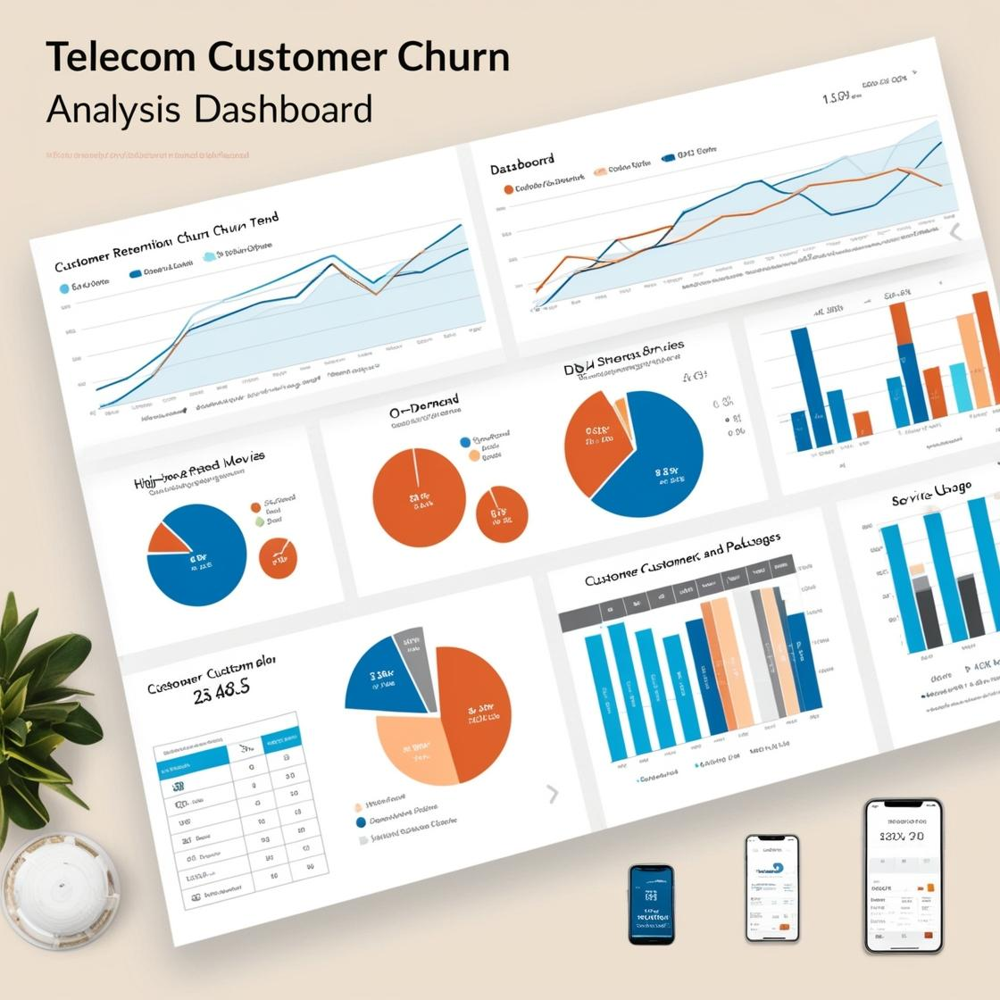

---

# Project: Customer Churn Analysis

---

## Project Description:
This project aims to analyze customer churn data to:

- Identify patterns and factors that contribute to customer turnover.
- Answer specific business questions related to:
  - **Customer demographics**
  - **Account details**
  - **Service preferences**

By examining customer attributes, service usage, and payment behaviors, we aim to uncover insights that will help the company:

- Optimize its retention strategies.
- Identify at-risk customers.
- Improve service offerings.

## Objectives:

### 1. Data Cleaning:
   - Handle any potential data inconsistencies, identify and manage outliers to ensure data quality.

### 2. Data Visualization:
   - Create visualizations to explore key trends and patterns in customer demographics and service usage, focusing on factors that influence churn.

### 3. Correlation Analysis:
   - Analyze relationships between customer demographics, account details, and service preferences to identify factors that affect churn rates.

### 4. Answering Business Questions:
   - Provide insights on specific business questions, including demographics (e.g., gender, senior citizen status, partnership and dependents status), service usage (e.g., Internet services, StreamingTV), and customer payment methods.

### 5. Encoding and Normalization:
   - Prepare categorical and numerical data for further analysis and predictive modeling.

## Dataset Overview:
The dataset provides detailed information about customer demographics, services they are subscribed to, and account details, such as:

- **Customer Demographics:**
   - Gender, age range, partnership status, and dependents status.

- **Account Details:**
   - Tenure, contract type, payment method, paperless billing status, monthly and total charges.

- **Service Usage:**
   - Details on subscribed services including phone, internet, online security, online backup, device protection, tech support, streaming TV, and movies.

- **Churn Status:**
   - Indicates if the customer left the company within the last month.

## Analysis Steps:

### 1. Data Cleaning:
   - Ensure data accuracy by handling potential inconsistencies and outliers.

### 2. Data Exploration:
   - Investigate general trends and distributions within the dataset, focusing on key attributes that influence churn.

### 3. Correlation Analysis:
   - Use a correlation matrix to examine relationships between variables (e.g., Internet Services, contract type) and their influence on churn.

### 4. Answering Business Questions:

#### Business Questions:
   1. What is the ratio of males to females in our company?
   2. What is the ratio of senior citizens to non-senior citizens in our company?
   3. What is the ratio of customers with partners to those without partners?
   4. What is the ratio of customers with dependents to those without dependents?
   5. What is the ratio of customers with multiple lines to those without?
   6. Based on the correlation matrix, which variables have a strong relationship with each other?
   7. What is the relationship between Internet Services and churn rate?
   8. How many Internet Services do we provide in our company? (List names and ratios.)
   9. What are the contract types we offer? (List names and ratios.)
   10. How many customers use StreamingTV?
   11. What is the ratio of movie streamers to StreamingTV subscribers?
   12. Is there a strong relationship between the monthly charge rate and having dependents?
   13. Who is the most valuable customer in the company based on Monthly and Total Charges?
   14. How many payment methods do we provide? What is the ratio between them?
   15. What is our churn rate?
   16. What is the average monthly charge?
   17. From the correlation matrix, what is the relationship between senior citizens and the monthly charge rate?
   18. We want to offer promotions based on monthly charge categories. Can you explain that?
   19. We want to offer promotions based on gender and partnership status. Can you explain that?

### 5. Encoding and Normalization:
   - Transform categorical data and normalize numerical features for further analysis.

## Required Libraries:
- **pandas**
- **matplotlib**
- **seaborn**
- **sklearn**

---
